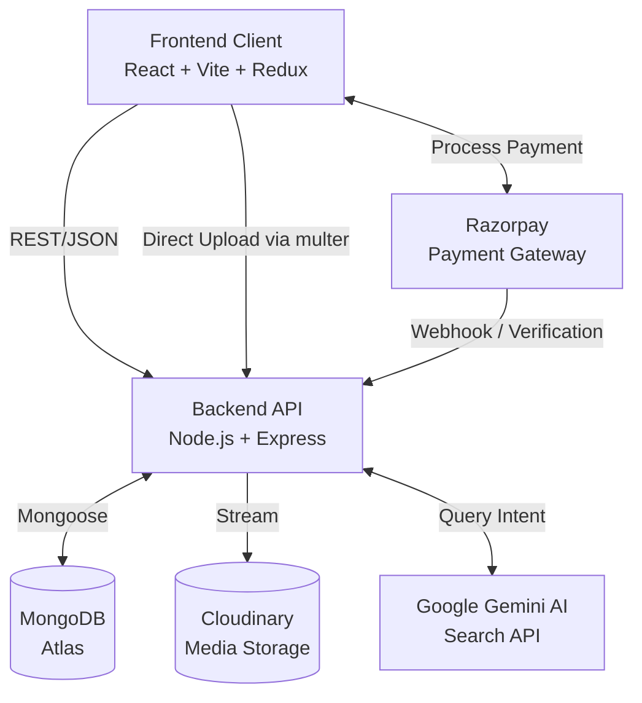

<div align="center">
  <br />
  
  # 🎓 Virtual Courses - AI Learning Platform
  
  **An enterprise-grade, AI-powered Learning Management System (LMS) built with the MERN stack.**

  [](https://reactjs.org/)
  [](https://nodejs.org/)
  [](https://tailwindcss.com/)
  [](https://ai.google.dev/)
  [](https://opensource.org/licenses/MIT)

  [**Explore the Docs**](#-table-of-contents) · [**View Live Demo**](https://ai-learning-platform-i9qfllshs-musics-projects.vercel.app) · [**Report Bug**](https://github.com/prathameshkamble979/AI-Learning-Platform/issues)
</div>

---

## 📖 Overview

**Virtual Courses** is a next-generation Learning Management System designed to bridge the gap between educators and learners. It goes beyond traditional course delivery by integrating Google's **Gemini AI** to understand user intent and instantly match them with the most relevant learning paths.

Featuring a robust multi-role architecture, secure payment processing via Razorpay, scalable cloud storage with Cloudinary, and a highly responsive Tailwind CSS interface, Virtual Courses is built for scale and performance.

---

## ✨ Key Features

- 🧠 **AI-Powered Search:** Natural language search powered by Google Gemini AI analyzes user intent to recommend the perfect course.
- 🎭 **Role-Based Access Control:** Distinct workflows and dashboards for **Students** and **Educators**.
- 📹 **Cloud Media Streaming:** Direct-to-cloud lecture video uploads via `multer-storage-cloudinary` to prevent server bottlenecks.
- 💳 **Secure Payments:** Full Razorpay integration with secure HMAC-SHA256 signature verification.
- 📊 **Educator Dashboard:** Real-time analytics and course management tools utilizing `recharts`.
- 🔐 **Advanced Security:** JWT-based authentication, HttpOnly cookies, OTP password resets, and bcrypt password hashing.
- ⚡ **Optimized Search Engine:** High-performance MongoDB `$text` indexing across course catalogs.


## 🏗 System Architecture



---

## 💻 Tech Stack

### Frontend
* **Core:** React 19, React Router DOM v7
* **Build Tool:** Vite
* **State Management:** Redux Toolkit
* **Styling:** Tailwind CSS v4
* **Components & UI:** React Icons, React Toastify, React Spinners
* **Charts:** Recharts

### Backend
* **Core:** Node.js, Express.js
* **Database:** MongoDB, Mongoose
* **Authentication:** JSON Web Tokens (JWT), bcryptjs
* **File Uploads:** Multer, Multer-Storage-Cloudinary
* **3rd Party Integrations:** 
  * Google GenAI (Gemini)
  * Razorpay
  * Nodemailer

---

## 📂 Folder Structure

```text
AI-Learning-Platform/
├── backend/
│   ├── config/          # DB, email, and token configurations
│   ├── controller/      # Core business logic (Auth, Course, Search, Order)
│   ├── middleware/      # Multer Cloudinary storage
│   ├── model/           # Mongoose schemas (User, Course, Lecture, Review)
│   ├── route/           # Express API route definitions
│   └── index.js         # Backend entry point
└── frontend/
    ├── src/
    │   ├── assets/      # Static images and icons
    │   ├── component/   # Reusable UI components
    │   ├── customHooks/ # Data fetching hooks
    │   ├── pages/       # Route-level components (Home, Dashboard, etc.)
    │   ├── redux/       # Redux slices and store configuration
    │   ├── App.jsx      # Main application router
    │   └── main.jsx     # Frontend entry point
    └── vite.config.js   # Vite configuration
```

---

## 🚀 Installation & Setup

### Prerequisites
* Node.js (v18 or higher)
* MongoDB Database URI
* Cloudinary Account
* Razorpay Account
* Google Gemini API Key

### 1. Clone the Repository
```bash
git clone https://github.com/prathameshkamble979/AI-Learning-Platform.git
cd AI-Learning-Platform
```

### 2. Backend Setup
```bash
cd backend
npm install
```

Create a `.env` file in the `backend` directory:
```env
PORT=8000
FRONTEND_URL=http://localhost:5173
MONGODB_URI=your_mongodb_connection_string
JWT_SECRET=your_jwt_secret

# Google Gemini
GEMINI_API_KEY=your_gemini_api_key

# Cloudinary
CLOUDINARY_NAME=your_cloud_name
CLOUDINARY_API_KEY=your_api_key
CLOUDINARY_API_SECRET=your_api_secret

# Razorpay
RAZORPAY_KEY_ID=your_razorpay_key_id
RAZORPAY_KEY_SECRET=your_razorpay_key_secret

# Email (Nodemailer)
EMAIL_USER=your_email@gmail.com
EMAIL_PASS=your_app_password
```
Start the backend server:
```bash
npm run dev
```

### 3. Frontend Setup
```bash
cd ../frontend
npm install
```

Create a `.env` file in the `frontend` directory:
```env
VITE_BACKEND_URL=http://localhost:8000
VITE_RAZORPAY_KEY_ID=your_razorpay_key_id
VITE_FIREBASE_APIKEY=your_firebase_api_key
```
Start the frontend development server:
```bash
npm run dev
```

---

## 🌐 API Documentation

### Authentication Routes
| Method | Endpoint | Description |
|---|---|---|
| POST | `/api/auth/signup` | Register a new user (Student/Educator) |
| POST | `/api/auth/login` | Login user & generate JWT |
| POST | `/api/auth/sendotp` | Send OTP for password recovery |
| POST | `/api/auth/resetpassword`| Reset password using OTP |

### Course Routes
| Method | Endpoint | Description |
|---|---|---|
| GET | `/api/course/published` | Get all published courses |
| GET | `/api/course/:courseId` | Get specific course details |
| POST | `/api/course/create` | Create a new course (Educator only) |
| PUT | `/api/course/edit/:courseId`| Update course details and thumbnail |

### Search & Payment
| Method | Endpoint | Description |
|---|---|---|
| POST | `/api/search` | AI-powered natural language search |
| POST | `/api/order/razorpay-order`| Initialize Razorpay payment intent |
| POST | `/api/order/verify-payment`| Verify HMAC signature and enroll student |

---

## 🗺️ Future Roadmap

- [ ] **Mobile Application:** Build a companion app using React Native.
- [ ] **Live Streaming:** Integrate WebRTC for live educator broadcasting.
- [ ] **Certificates:** Auto-generate PDF completion certificates.
- [ ] **Quizzes & Assessments:** Interactive testing modules for students.

---

## 🤝 Contributing

Contributions, issues, and feature requests are welcome!
Feel free to check the [issues page](#).

1. Fork the Project
2. Create your Feature Branch (`git checkout -b feature/AmazingFeature`)
3. Commit your Changes (`git commit -m 'Add some AmazingFeature'`)
4. Push to the Branch (`git push origin feature/AmazingFeature`)
5. Open a Pull Request

---

## 📜 License

Distributed under the MIT License. See `LICENSE` for more information.

---

## 📬 Contact

**Prathamesh Kamble**

* [GitHub](https://github.com/prathameshkamble979)

---
<div align="center">
  <i>If you found this project helpful, please give it a ⭐️!</i>
</div>
